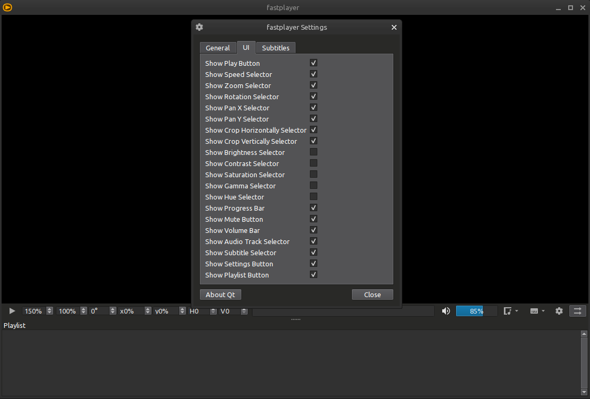

# fastplayer
Video player made with Qt and mpv, with access to many mpv functions.



Drag video files or folders into the player window to add to playlist.

Also via terminal `fastplayer <my_video.mp4>` or `fastplayer --new <my_video.mp4>` to open a new instance.

# Dependencies

- Qt6
- [mpv](https://github.com/mpv-player/mpv)

# Installation
``` bash
git clone https://github.com/elviosak/fastplayer
cd fastplayer
make
sudo make install
```

License: [LGPL-2.1+](LICENSE "License")